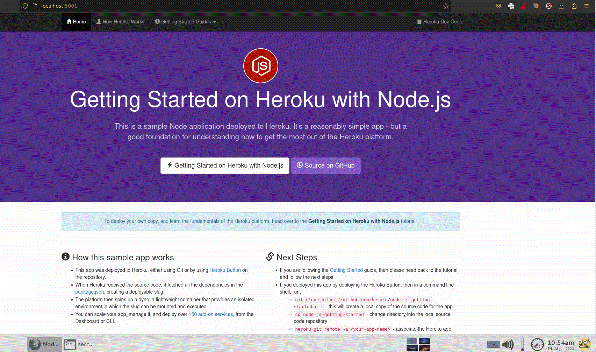
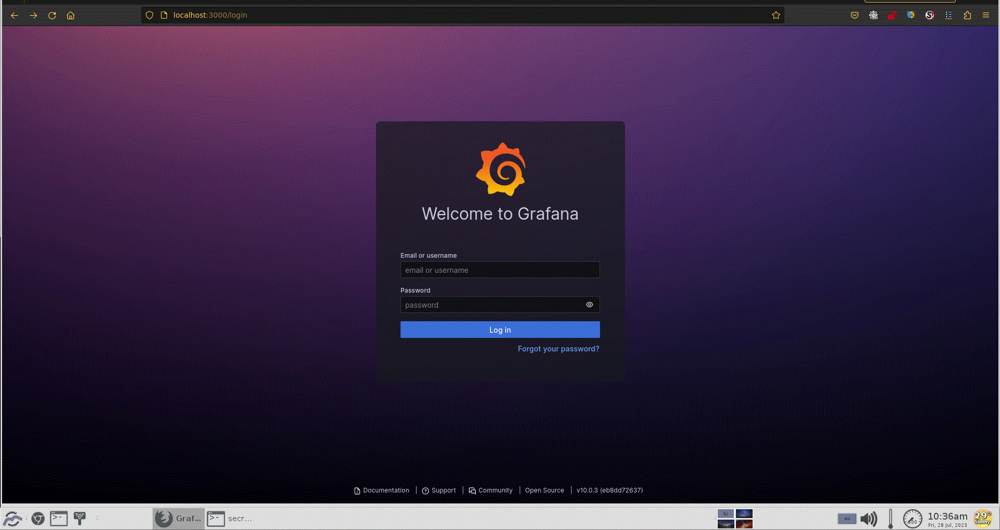

# 02

## Q: 
Prepare a docker-compose with Loki, Grafana, Promtail and nodeJS application ( https://github.com/heroku/node-js-getting-started ). Setup log collection from nodeJS application.


## A: 

1. clone the "node-js-getting-started" on [local](node-js-getting-started/README.md)
2. create a file ["docker-compose.yml"](docker-compose.yml)
3. create a file ["loki-config/local-config.yaml"](loki-config/local-config.yaml)
4. create a file ["promtail-config/config.yml"](promtail-config/config.yml)
5. Run the command "docker-compose up --build"
```shell
$ sudo docker-compose up --build | tee ./02.log
```
The result file ["02.log"](02.log)

6. check the "node-js-getting-started" and "grafana"



